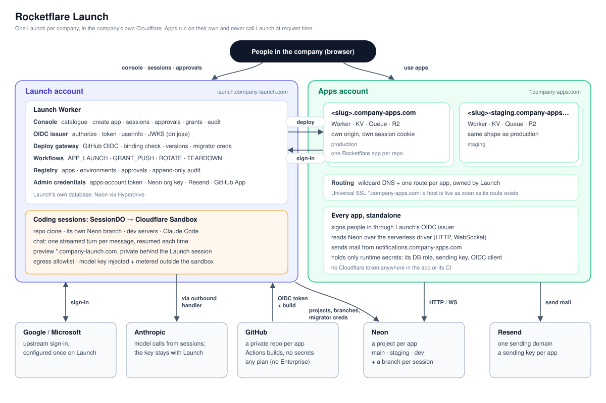

# Rocketflare Launch

**Unlock your builders, safely.**

Launch is the company console for [Rocketflare](https://rocketflare.dev) ([GitHub](https://github.com/rocketflare-dev/rocketflare))
apps. Anyone can go from an idea to a secure, production app in the browser, while IT keeps
control of credentials, sign-in, approvals and audit.

> Status: **P0 done; P1 built locally, not yet deployed: the app registry, health, the OIDC issuer,
> setup and audit. P2 (create an app) built and tested locally against a simulated cloud; not yet
> deployed. P3 (coding sessions) built and tested locally (fakes + a real local container); not
> yet deployed** (September 2026).
> Results: [spikes/SUMMARY.md](spikes/SUMMARY.md).

## Why

Rocketflare already makes one app fast to build: multi-tenant auth, Postgres, queues, AI and
agent context on Cloudflare. At company scale, the hard part is everything around each app:
accounts, databases, DNS, secrets, sign-in, deploys, approvals, upgrades. Launch does that part,
so that:

- **Building is self-service.** Describe a change, watch it in a live preview, and ship a pull
  request. Claude Code runs in a Cloudflare Sandbox against the app's real repo.
- **Every app is production-grade from day one.** Each app gets its own repo, Worker, Neon
  database, email identity and `<slug>.<apps-domain>` host. They are all set up by Launch and
  all in the company's own Cloudflare.
- **IT stays in control.** Admin credentials never leave Launch, and each app gets narrowly scoped
  ones. There is one company sign-in across every app. Production deploys and access to shared
  secrets, such as the M365 connection, need an approval in Launch, and all of it is in one audit
  log.
- **The fleet stays current.** Kit upgrades, credential rotation and teardown are run across every
  app by Launch.

## Launch and Rocketflare

**Rocketflare is the only app template Launch creates and manages**: Launch is built for
Rocketflare apps. Every app Launch creates is a normal Rocketflare copy that keeps working, and
can still be deployed from its repo, without Launch.

The two are released separately. Launch drives apps through the files and endpoints every
Rocketflare app already has (`.rocketflare.json`, the wrangler tomls, the deploy workflow, the
health endpoints, plugin manifests). It doesn't import kit code, so each can ship on its own
schedule ([spec/02](spec/02-template-contract.md)).

The P0 spikes found six changes the kit needs: an OIDC login, a Neon driver option, deploying
through an external deployer, configurable dev ports, bootstrap without Docker, and a Neon role
fix. All six have shipped (0.14.0 and 0.15.0). All are opt-in and off by default, so Rocketflare
stays a standalone product ([spec/13](spec/13-rocketflare-changes.md)).

## Key decisions

| # | Decision | Rejected alternatives | Spec |
|---|---|---|---|
| 1 | **One Launch per company**, deployed into that company's Cloudflare account. The admin credentials never leave it. | A hosted service serving many companies, which would hold every customer's admin keys | [01](spec/01-overview.md) |
| 2 | **Built for Rocketflare, released separately.** Seeded from the kit once, then it owns its code | Launch as a copy of the kit that tracks kit upgrades; Launch as a kit plugin | [01](spec/01-overview.md) |
| 3 | **A versioned Rocketflare contract** (files and endpoints every app has) is the only coupling | Importing the kit's provisioning code | [02](spec/02-template-contract.md) |
| 4 | **Admin credentials stay in Launch, and Launch deploys.** CI holds no Cloudflare token or production database credential; it proves who it is with GitHub OIDC and Launch checks every binding. Apps get only runtime credentials: their own database role and email sending key. Launch runs in its own Cloudflare account where possible | Per-Worker tokens in CI, which can't stop one app binding another app's data ([S1](spikes/s1-worker-token/RESULT.md)); shared account tokens | [03](spec/03-trust-and-credentials.md) |
| 5 | **Flat subdomains on a dedicated apps domain**: `<slug>.company-apps.com`, each app its own origin, Launch on its own domain (`launch.company-launch.com`) | Path routing (`company-apps.com/my-app/`); nested `<slug>.apps.example.com` on the main domain | [04](spec/04-hostnames-and-dns.md) |
| 6 | **Launch is the company's OIDC sign-in provider.** Google or Microsoft is configured once, every app signs in through Launch, and access is set per app | A shared parent-domain cookie; Cloudflare Access as the main login | [05](spec/05-identity-sso.md) |
| 7 | **Creating an app is a durable Workflow** of idempotent steps that can pause for approval | Running the kit's local provisioning script remotely | [06](spec/06-registry-and-pipeline.md) |
| 8 | **Coding sessions use the Claude Agent SDK on Cloudflare Sandbox**, with a live preview; each session ends in a PR | Claude Managed Agents (beta, not eligible for Zero Data Retention) | [07](spec/07-coding-sessions.md) |
| 9 | **Approvals and audit live in Launch, and so does the production gate.** Every deploy goes through Launch, which works on any GitHub plan | GitHub custom deployment protection rules (Enterprise-only on private repos); required reviewers configured only inside GitHub | [08](spec/08-approvals-audit-ship.md) |
| 10 | **Shared config and secrets are granted, not copied.** An app requests a bundle, its owner approves, and Launch pushes the values and re-pushes them on rotation | Apps fetching config from Launch at runtime | [09](spec/09-config-and-grants.md) |

## Architecture

Launch and the apps live in separate Cloudflare accounts, both owned by the company (strongly
recommended: an app's Worker can bind anything in its own account,
[S1](spikes/s1-worker-token/RESULT.md)). CI never holds a Cloudflare token: GitHub Actions builds,
proves who it is with OIDC, and Launch checks and deploys the build
([08](spec/08-approvals-audit-ship.md)).

## Roadmap

| Phase | Delivers | Exit test |
|---|---|---|
| P0 | This spec, and eight feasibility spikes | **Done**: every spike reported and the spec was updated ([spikes/SUMMARY.md](spikes/SUMMARY.md)) |
| P1 | Setup wizard (domain, IdP, OIDC issuer), registry, import of existing Rocketflare apps, audit log | An existing app is listed with live health, and its users sign in through Launch |
| P2 | Rocketflare adapter and the create-app pipeline | "Create app" leads to a live `<slug>.company-apps.com` with no terminal |
| P3 | Coding sessions: sandbox, live preview, PR | A non-engineer changes a screen and opens a PR from the browser |
| P4 | Approvals engine; production gated from Launch | A production deploy waits for, and is released by, an approval in Launch |
| P5 | Grant catalogue and rotation | An app requests M365, is approved, receives the secret; one rotation updates every holder |
| P6 | Fleet upgrades and teardown | One click opens upgrade PRs across the fleet; an archived app leaves no resources behind |

Details: [spec/11-roadmap.md](spec/11-roadmap.md).

## What the spikes settled

Eight P0 spikes ran against real accounts ([spikes/SUMMARY.md](spikes/SUMMARY.md)):

- **Hosts:** flat `<slug>.company-apps.com` on a wildcard record. Every host is live ~100 ms after
  its route is created, under the free wildcard certificate.
- **Email:** one Resend domain for the fleet, with a key per app.
- **Database:** Neon per app, reached with Neon's serverless driver. Hyperdrive would cap the fleet
  at ~12 apps.
- **Deploys:** Launch deploys every app. A per-Worker Cloudflare token can bind other apps' data,
  so CI holds no token. This works on any GitHub plan; Enterprise isn't needed.
- **Sign-in:** a ~200-line `jose` OIDC issuer passed a standard client. OpenAuth can't issue
  `id_token`s.
- **Coding sessions:**
  - 24 s from nothing to a live, private preview, on a Neon branch per session;
  - a streamed Claude Code chat that resumes across turns;
  - no model key in the sandbox (Launch injects and meters it).

## Biggest open questions

- **The kit changes** in [spec/13](spec/13-rocketflare-changes.md), especially the Neon driver
  (with transactions) and deploying through an external deployer. Until the kit takes them, the
  adapter has to patch every app.
- **Session rollouts.** Changing the session image interrupts live sessions, so sessions must be
  drained or checkpointed first.
- **Concurrent sessions per app.** Neon caps branches per project (10 on Launch, 25 on Scale), and
  each session uses one.
- **Session cost policy.** Budgets per session, per team and per month.

All of them: [spec/12-open-questions.md](spec/12-open-questions.md).

## Spec index

1. [Overview and boundary with Rocketflare](spec/01-overview.md)
2. [The app-template contract](spec/02-template-contract.md)
3. [Trust model and credentials](spec/03-trust-and-credentials.md)
4. [Hostnames and DNS](spec/04-hostnames-and-dns.md)
5. [Identity and single sign-on](spec/05-identity-sso.md)
6. [App registry and the launch pipeline](spec/06-registry-and-pipeline.md)
7. [Coding sessions](spec/07-coding-sessions.md)
8. [Approvals, audit and shipping](spec/08-approvals-audit-ship.md)
9. [Shared config and secret grants](spec/09-config-and-grants.md)
10. [Fleet operations](spec/10-fleet-operations.md)
11. [Roadmap](spec/11-roadmap.md)
12. [Open questions](spec/12-open-questions.md)
13. [What Rocketflare needs to change](spec/13-rocketflare-changes.md)
14. [Sources](spec/sources.md)
15. [P0 spike results](spikes/SUMMARY.md)

## License

Copyright © 2026 Clifton Cunningham. Launch is source-available under the
[Elastic License 2.0](LICENSE). You may use, modify and self-host it, including inside your
company for commercial work. You may not offer it to others as a hosted or managed service, or
remove or circumvent any licence-key functionality.

[Rocketflare](https://rocketflare.dev) itself is
[MIT](https://github.com/rocketflare-dev/rocketflare/blob/main/LICENSE). The apps Launch creates
from it belong to the company that creates them, and it can license them however it likes. MIT
only asks that the kit's copyright notice is kept. Launch's licence doesn't extend to them.
